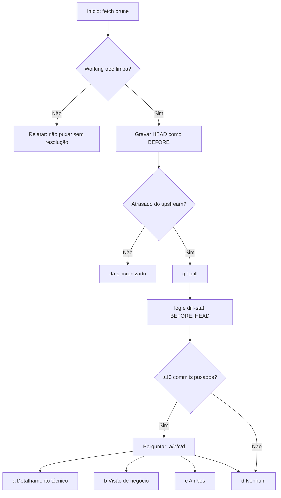

# Morning Git Sync
# Auhor: Walker A. Ataide

## When to apply

- Início de sessão de trabalho com pedido de sincronizar o repositório.
- Comandos como: sincronizar com o remoto, fazer pull, o que chegou no origin, atualizar minha branch.
- Sempre que o usuário quiser um relatório curto do que foi puxado desde o último HEAD local (antes do pull desta operação).

## Regras de segurança

- Não fazer `pull` destrutivo com working tree suja sem o usuário alinhar (commit, stash, ou ordem explícita).
- Em conflito no pull: parar, listar arquivos conflitantes, não forçar merge.
- Não exibir conteúdo de segredos; se houver muita alteração em `.env*` ou arquivos de credenciais, avisar sem colar valores.

## Fluxo (executar na ordem)

1. **Raiz do repositório**  
   `git rev-parse --show-toplevel` a partir do workspace e `cd` para operar aí.

2. **Branch e upstream**  
   - Branch: `git branch --show-current`  
   - Upstream: `git rev-parse --abbrev-ref '@{u}'` 2>/dev/null — se falhar, informar o usuário e sugerir `git branch -u <remote>/<branch>` ou trocar de branch.

3. **Fetch**  
   `git fetch --prune`

4. **Working tree**  
   Se `git status --porcelain` não for vazio: explicar o risco, não prosseguir com pull. Opções: commit, `git stash` (e depois pull) ou aprovação explícita de `git pull` / `git pull --rebase` conforme política do time. Só continuar a partir do passo 5 com árvore limpa ou com stash e instrução clara do usuário.

5. **Atraso em relação ao remoto**  
   `git status -sb` e/ou `git rev-list --left-right --count 'HEAD...@{u}'`  
   - `0	0`: nada a integrar; reportar “já em dia” e **não** rodar pull.  
   - Só o segundo número >0 (atraso): há o que puxar — seguir a partir do passo 6.  
   - Primeiro e segundo >0: **branch divergida**; não fazer `pull` automático. Explicar, sugerir `git status`, `git log --oneline --left-right HEAD...@{u}` e opções alinhadas ao time (rebase, merge, revisão manual).  
   - Só o primeiro >0: à frente do remoto, sem atraso; avisar commits não enviados; sem pull (nada a “baixar”).

6. **Antes do pull — gravar o HEAD atual**  
   `BEFORE=$(git rev-parse HEAD)`  
   (Apenas se houver de fato um pull a fazer. Se o passo 5 concluiu “já atualizado”, não rodar pull; o relatório dirá 0 commits.)

7. **Pull**  
   `git pull` (ou `git pull --rebase` se o projeto padronizar rebase; em dúvida, preferir o que o upstream já exige, ou o pedido do usuário.)

8. **Falha**  
   Conflito ou merge abortado: `git status`, resumir caminhos em conflito, parar.

9. **Resumo pós-sincronização** (intervalo: mudanças incorporadas agora)  
   - `git log --oneline "$BEFORE"..HEAD` (se necessário, limitar: `| head -n 50` e dizer se truncado)  
   - `git diff --stat "$BEFORE"..HEAD`  
   - Opcional, se a lista for útil: `git shortlog -sn "$BEFORE"..HEAD`  
   Se não houve pull, omitir o intervalo `BEFORE..HEAD` e dizer “nenhum commit puxado — repositório já alinhado ao `@{u}` após o fetch”.

10. **Relatórios longos**  
   Se `diff --stat` for muito extenso, agrupar brevemente por pastas de topo do monorepo (ex.: `backend/`, `frontend/`, `docs/`) e citar totais, sem listar todos os arquivos.

11. **Oferta de detalhamento (pós-relatório)**
   Após gerar o relatório, se houver ≥10 commits puxados, perguntar ao usuário **qual nível de detalhamento** ele quer, oferecendo três opções:
   - **a) Detalhamento técnico por categoria** — agrupa os commits por tipo (feat, fix, docs, test, chore, refactor, raw), descrevendo cada grupo com escopo, arquivos relevantes e impacto técnico. Inclui contagem por tipo e top scopes. Útil para devs entenderem o que mudou no código.
   - **b) Visão de negócio simplificada** — traduz as alterações para o **ponto de vista do produto/usuário final**, em linguagem não técnica. Cada bloco descreve o que o usuário (admin, professor, aluno, responsável, secretário) passa a poder fazer (ou não fazer mais), sem citar arquivos, classes ou comandos. Usa emojis temáticos por área de negócio (🆘 suporte, 🔐 segurança, 📋 matrícula, 📊 notas, etc.). Termina com um parágrafo "**Em uma frase:**" resumindo a release.
   - **c) Ambos** — gera primeiro (a), depois (b).
   - **d) Nenhum** — encerra (relatório já gerado).

   Use **AskUserQuestion** com as 4 opções acima quando houver ≥10 commits. Se houver entre 1 e 9 commits, oferecer apenas (b) (visão de negócio) ou nenhum, pois o relatório técnico já cabe inline.

   ### Como gerar a "Visão de negócio simplificada" (opção b)

   1. **Mapear escopo técnico → área de negócio.** Use a tabela de scopes do projeto (ver `CLAUDE.md`) e traduza:
      - `auth/users/security` → 🔐 Login e segurança
      - `support/feedback` → 🆘 Canal de Suporte
      - `enrollment/matricula` → 📋 Matrícula
      - `cadastros/schools/students/guardians` → 🏫 Cadastros
      - `notas/grades/boletim` → 📊 Notas e Boletim
      - `academy/assessments/video-lessons/training` → 🎓 Aprendizagem (Academy)
      - `matrix/curriculum` → 📚 Matriz Curricular
      - `tutoriais` → 📺 Tutoriais
      - `feature-flags/tenants/admin` → 👑 Administração
      - `db/migrations/seeders/infra/observability` → ⚙️ Bastidores
      - `notifications/mail` → 🔔 Notificações
   2. **Filtrar ruído.** Ignorar commits de `chore`, `style`, `refactor` puros, `raw` e `cleanup` na narrativa de negócio — só citar se o impacto for visível ao usuário (ex.: migration que renomeia "Médio" → "Ano" é visível; refactor de port não é).
   3. **Escrever por persona.** Cada bloco responde "quem ganha o quê?". Frases curtas, voz ativa: *"Aluno agora faz login com username"*, *"Diretor pode editar tutoriais"*, *"Admin enxerga dados de qualquer município"*.
   4. **Sem jargão.** Nunca usar: aggregate, port, repository, controller, VO, listener, outbox, RLS, GUC, DTO, payload, endpoint, RBAC. Substituir por: *regra de negócio, integração, banco, tela, ação, registro de auditoria, permissão*.
   5. **Bastidores em bloco único.** Mudanças de infra/db/seed que afetam comportamento (timezone, renomeações, auditoria com `actor_id`) entram em "⚙️ Bastidores" com 1 linha cada.
   6. **Encerramento.** Sempre fechar com **"Em uma frase:"** sintetizando o foco da release em ≤2 linhas.

   ### Template da visão de negócio

   ```markdown
   ## O que mudou — visão de negócio

   ### <emoji> <Título da área> (1 linha de hook)
   <2-4 linhas descrevendo o que o usuário passa a poder fazer, em linguagem não técnica>

   ### <emoji> <Próxima área>
   ...

   ### ⚙️ Bastidores
   - <mudança invisível mas relevante 1>
   - <mudança invisível mas relevante 2>

   ---

   **Em uma frase:** <síntese da release em ≤2 linhas>
   ```

## Template do relatório

Use a estrutura abaixo; preencha com a saída real dos comandos (pt-BR).

```markdown
## Sincronização — <data ISO, ex.: 2026-04-29> (fuso: informar se relevante)

- **Repositório:** <caminho do toplevel>
- **Branch:** <nome>
- **Upstream:** <ex.: origin/main> ou “sem upstream”
- **Commits puxados nesta operação:** <N> ou “0 — já estava em dia com o remoto após o fetch”

### Commits (ordem padrão do `git log`, mais recentes primeiro)
- <linhas de `git log --oneline` entre BEFORE e HEAD; omitir seção se N=0>

### Resumo de arquivos
<saída de `git diff --stat` resumida ou agrupada por pastas; omitir se N=0>
```

## Diagrama (referência)



O diagrama de decisão: em “Já sincronizado” o fluxo ainda gera o relatório informando 0 commits puxados (após `fetch`). A oferta de detalhamento só aparece com ≥10 commits puxados.

## Referência

Para detalhes de comandos Git, ver a documentação e a política de branches do projeto (`CLAUDE.md`, se existir).
